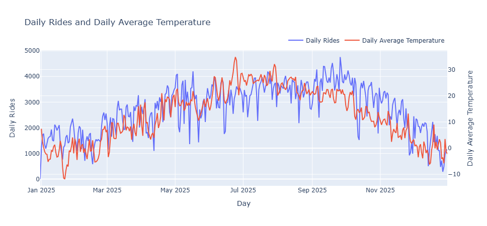

# End-to-End Geospatial Analytics Pipeline

## Project Objective & Workflow {.smaller}

- **Automated Data Pipeline:** 
  - Ingesting, cleaning, and merging 2025 Citi Bike monthly trips with Open-Meteo weather data and Jersey City GeoJSON boundaries.

- **Spatial & Database Integration:** 
  - Storing structured data and spatial geometries in a containerized **PostgreSQL/PostGIS** database using Docker and SQLAlchemy.

- **Advanced Analytics & Visualization:** 
  - Building optimized **Materialized Views** with spatial indices to power high-performance interactive **Tableau dashboards**.

## Technical Challenges {.smaller}

- **Large-Scale Data Processing:**
  - Processing 12 monthly Citi Bike CSV files 
  - Handling missing or inconsistent coordinate data and timestamps  
  - Merging spatial GeoJSON boundaries with tabular ride data  

- **Data Processing & Optimization::**
  - Merging daily Citi Bike trips with Open-Meteo weather API  
  - Speeding up spatial queries using PostGIS spatial indexing  
  - Structuring optimized Materialized Views for seamless Tableau visualization 

## Pipeline Architecture & Workflow {.smaller}
- **Automation:** Python scripts handling extraction, cleaning, and transformation.
- **Storage:** Containerized PostgreSQL/PostGIS for robust geospatial querying.
- **Visualization:** Interactive dashboard for actionable urban mobility insights.

## Key Analytical Questions {.smaller}

- **Weather & Environmental Impact:** 
  - How do temperature changes, precipitation, and wind speeds affect daily ridership and trip durations?
- **Member vs. Casual Dynamics:** 
  - What are the main differences in usage patterns between annual subscribers and casual riders?
- **Spatial Mobility & Hotspots:** 
  - Which neighborhoods and stations drive the highest traffic and clustering?

## Key Takeaways

- **Daily Rides vs. Maximum Wind Speed:**

- Shows a slight negative trend: Increased wind speed corresponds to a moderate decrease in daily ridership.

## 

[Daily Rides vs. Maximum Wind Speed](img/Daily_Rides_vs_Average_Temperature.png)  

- **Seasonal Trends (Daily Rides and Daily Average Temperature):**

##

 

- Proves a direct seasonal dependency, where warmer summer conditions drive maximum ridership while colder winter periods sharply reduce trip frequencies.
- **Seasonal Trends (Daily Rides and Daily Average Temperature):**

##

 

>Highlights station activity density across Jersey City neighborhoods using spatial aggregation and PostGIS boundaries.

## Key Insights & Conclusions {.smaller}

- **Weather Impact on Ridership:** 
  - Daily temperatures strongly correlate with overall ride volumes, while high winds and precipitation noticeably decrease daily trips.
- **Member vs. Casual Behavior:** 
  - Annual members drive steady weekday commuter patterns, whereas casual riders show higher flexibility, peaking during weekends and warm weather.
- **Spatial Hotspots:** 
  - High-density activity is heavily concentrated around core urban neighborhoods and major transit hubs like Grove Street PATH.

[Linkedin](https://www.linkedin.com/in/mari-hayrapetyan-da)

    